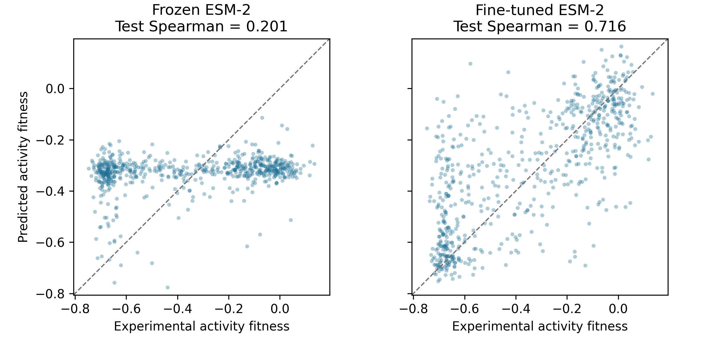

# RgDAAO-ESM2

[](https://github.com/jjimenezgar/RgDAAO-ESM2/actions/workflows/tests.yml)
[](https://colab.research.google.com/github/jjimenezgar/RgDAAO-ESM2/blob/main/notebooks/RgDAAO_ESM2_benchmark.ipynb)

A focused supervised protein language model benchmark: **does fine-tuning ESM-2
improve prediction of experimental RgDAAO mutation effects over a frozen backbone?**

*Rhodotorula gracilis* D-amino acid oxidase is a flavoprotein biocatalyst that
oxidizes D-amino acids. This project uses the EP-Seq D-alanine activity assay
from [Vanella et al., Nature Communications (2024)](https://doi.org/10.1038/s41467-024-45630-3).
It compares established transfer-learning strategies; it introduces no new model
or enzyme-engineering method.

## Dataset

**6,399 paired single-missense variants**, reproduced from the authors'
[Zenodo deposit](https://doi.org/10.5281/zenodo.8388902). Input: 365-residue mutated
sequence. Target: direct experimental activity fitness relative to WT.

The target is `2309_Figure_2.xlsx` → `Fig2_H` → `activity  score`, joined with
expression measurements to reproduce the paper's cohort. It is **not** the
activity/expression-normalized hotspot score. Every mutation is checked against
the coding sequence in `DAOx_ref.fa`; no numbering corrections are inferred.
[Exact provenance, filters and audit caveats](data/README.md).

## Comparison

| | Frozen ESM-2 | Fine-tuned ESM-2 |
|---|---|---|
| Backbone | Frozen | Trainable |
| Regression head | Trainable | Same head, trainable |
| Trainable parameters | 103,041 | 7,840,442 |
| Model | `facebook/esm2_t6_8M_UR50D` | Same pinned revision |

Both use seed 42 and identical **5,119 / 639 / 641** train/validation/test splits.
The head initialization, head learning rate, batch size and 20-epoch budget are
shared. Checkpoints are selected by validation **Spearman**; test evaluation
happens only after both models finish training. Pearson, MAE and RMSE are also
reported. [Full protocol](docs/benchmark.md).

## Results

**Fine-tuning improved held-out prediction in the completed seed-42 benchmark.**
Both models were evaluated on the same 641 test variants after validation-based
checkpoint selection.

| Test metric | Frozen ESM-2 | Fine-tuned ESM-2 |
|---|---:|---:|
| Spearman ↑ | 0.201 | **0.716** |
| Pearson ↑ | 0.227 | **0.728** |
| MAE ↓ | 0.244 | **0.145** |
| RMSE ↓ | 0.270 | **0.197** |

MAE decreased by **40.4%** and RMSE by **27.0%** relative to this frozen baseline.
Spearman measures ranking agreement, not percentage accuracy. Errors are in the
original experimental fitness units.



This is one fixed split and seed, measuring interpolation within RgDAAO.
The 310 mutated positions represented in test also occur in training with other
substitutions; no exact variants or sequences overlap across splits.
[Run evidence, learning curves and limitations](docs/results/seed42/README.md)
include original predictions, metrics, configurations and execution records.

## Reproduce

Python 3.10+; a GPU is recommended for the complete comparison. The Colab link
above runs this repository in two cells. Locally:

```bash
python -m venv .venv
source .venv/bin/activate
pip install -e ".[ml,dev]"
python scripts/download_data.py
python scripts/build_dataset.py
python -m rgdaao.prepare --input data/processed/variants.csv --output data/processed
python scripts/smoke_test.py
bash scripts/run_benchmark.sh
```

The runner saves selected checkpoints, configuration, software environment,
validation history, test metrics and `predictions.csv` per model. Scientific
figures and `comparison.csv` are generated only after real test evaluation.
Outputs go to `results/`; keep that folder or download the Colab results ZIP.
The frozen run and fine-tuning run are sequential, each with 20 epochs and
12,800 training steps; a progress-bar reset between them is expected.

Inspect the published result without retraining or downloading model weights:

```bash
pip install -e ".[dev]"
python scripts/verify_results.py
```

To regenerate its prediction figure, install the ML extras and run
`python scripts/plot_results.py --results-dir docs/results/seed42`.
Run verification before plotting: it checks the original imported artifacts;
regenerated image bytes can vary with Matplotlib versions.

Lightweight CI needs only `pip install -e ".[dev]"` and `pytest -q`; it never
downloads pretrained weights or trains ESM-2. A separate data workflow verifies
the processed deposit and rebuilds the dataset. Optional ML tests use a tiny
random model offline. [Committed audit records](docs/audit/).

## Interpretation

Random single-variant splitting measures interpolation within one enzyme and
can share mutated positions across splits. EP-Seq activity depends on cellular
expression/folding as well as catalysis; it is not purified-enzyme kinetics.
One split/seed cannot establish broad generalization, and model predictions do
not demonstrate experimentally improved enzymes. The observed improvement applies
to this benchmark and frozen-head baseline; it does not establish superiority to
other representations or tuned baselines.
