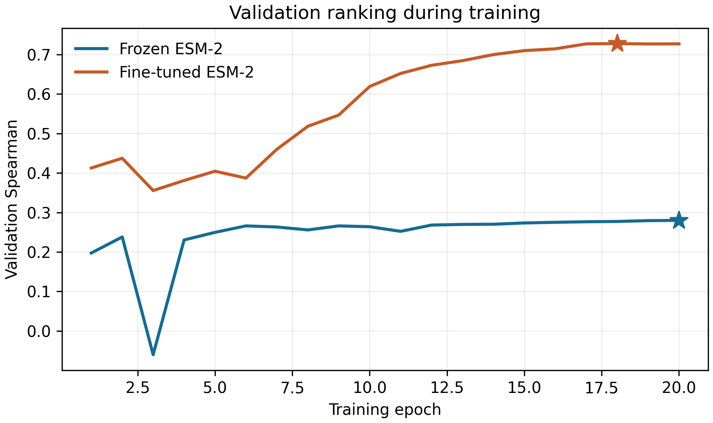

# Completed RgDAAO activity benchmark

The first fixed comparison completed on a Tesla T4 using clean training commit
[`35ecc071`](https://github.com/jjimenezgar/RgDAAO-ESM2/commit/35ecc07130d70b10749f00b9ee0c8440622565a1).
Supervised fine-tuning improved prediction of direct EP-Seq activity fitness
relative to the frozen ESM-2 backbone with the same regression head.

## Held-out results

| Test metric | Frozen ESM-2 | Fine-tuned ESM-2 |
|---|---:|---:|
| Spearman ↑ | 0.200683 | **0.715536** |
| Pearson ↑ | 0.227393 | **0.727779** |
| MAE ↓ | 0.243704 | **0.145199** |
| RMSE ↓ | 0.269860 | **0.196942** |

Both models predict the same **641 test variants** after checkpoint selection
on 639 validation variants; training used 5,119 variants. Seed: 42.
The absolute Spearman increase is 0.515; MAE decreases by 40.4%, RMSE by 27.0%.
Correlations are not accuracy percentages. MAE and RMSE retain the source
fitness units, without label scaling or expression normalization.


## Training and checkpoint selection

| Recorded setting | Frozen | Fine-tuned |
|---|---:|---:|
| Trainable parameters | 103,041 | 7,840,442 |
| Epochs completed | 20 | 20 |
| Optimizer steps | 12,800 | 12,800 |
| Selected checkpoint epoch | 20 | 18 |
| Selected validation Spearman | 0.280006 | 0.727833 |
| Training runtime | 18.9 min | 41.2 min |

Times are Trainer's recorded training runtime; setup, downloads, smoke tests,
final test evaluation and export add to wall-clock time. Runs are sequential:
the progress counter starts again for fine-tuning after frozen training ends.



Stars mark the selected checkpoints. The curve uses the first validation entry
at each training step. Trainer subsequently re-evaluates the restored best model:
the last fine-tuning history entry reports its epoch-18 performance with an
epoch-20 counter. This final entry is excluded from the curve. Selection uses
validation Spearman, not the lowest validation loss or test results.

## Evidence and verification

The imported records are retained verbatim from `RgDAAO-ESM2-results.zip`:

- [Full-precision comparison](comparison.csv).
- [Frozen predictions](esm2_frozen/predictions.csv) and
  [fine-tuned predictions](esm2_finetune/predictions.csv).
- Each model directory contains `metrics.json`, `run.json`, `config.json`,
  `history.json`, `environment.json` and `pip-freeze.txt`.
- [Data provenance](data_audit/provenance.json) and
  [split manifest](data_audit/split_summary.json).
- [Import audit](import_audit.json): archive/artifact SHA-256 values and checks
  against the original split CSVs and selected checkpoint bytes.

The archived environment records PyTorch 2.6.0, Transformers 4.48.3,
Accelerate 1.3.0 and CUDA 12.4. The pretrained model revision and all
hyperparameters are recorded in both configuration files.

From the repository root, without model downloads or GPU:

```bash
pip install -e ".[dev]"
python scripts/verify_results.py
```

CI verifies original imported artifact hashes, recomputes the metrics from
predictions, checks identical test identifiers/labels and configuration parity,
and confirms checkpoint selection against validation history.
The import audit additionally verified dataset/split hashes, prediction order
and labels against the archived test CSV, cross-split variant/sequence
disjointness, and selected model hashes. The full dataset and model weights are
not committed; the verification script checks the committed evidence, while
the original ZIP retains weights and complete split CSVs.

Figures can be regenerated from recorded predictions and history after
installing the ML extras:

```bash
python scripts/plot_results.py --results-dir docs/results/seed42
```

Verify before regenerating: image/PDF bytes can differ across Matplotlib
versions. Regeneration does not retrain or re-evaluate either model.
To repeat the complete experiment, follow the main README or run the Colab
notebook in a fresh runtime. The training commit above fixes the original code.

## Scope of the conclusion

This execution supports an improvement over this frozen CLS-token/head
baseline for random held-out single substitutions within RgDAAO. It does not
compare against every possible frozen embedding, regression method or tuned
baseline. The frozen model has low correlation and predictions compressed
around the central activity range, which limits this comparator.

No exact mutation IDs or sequences overlap between train, validation and test.
However, all **310 test positions** appear in training with other substitutions.
This is interpolation within one enzyme, not a position-held-out assessment.
One seed supplies no estimate of variability across training runs. Similar
validation and test Spearman (0.728 and 0.716) are encouraging but do not prove
generalization to unseen positions, multi-mutants or other enzymes.

The assay phenotype includes expression/folding effects and is not purified
enzyme kinetics. No improved enzyme has been experimentally demonstrated.
The [source-data caveats](../../../data/README.md) and
[benchmark protocol](../../benchmark.md) remain applicable.
